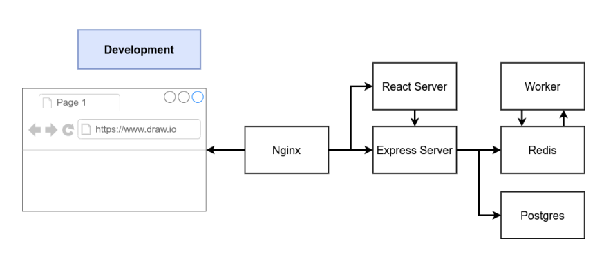
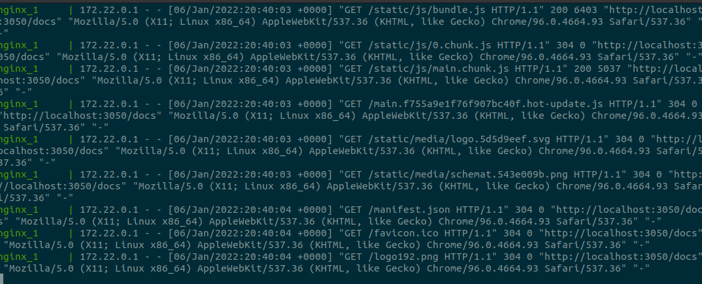
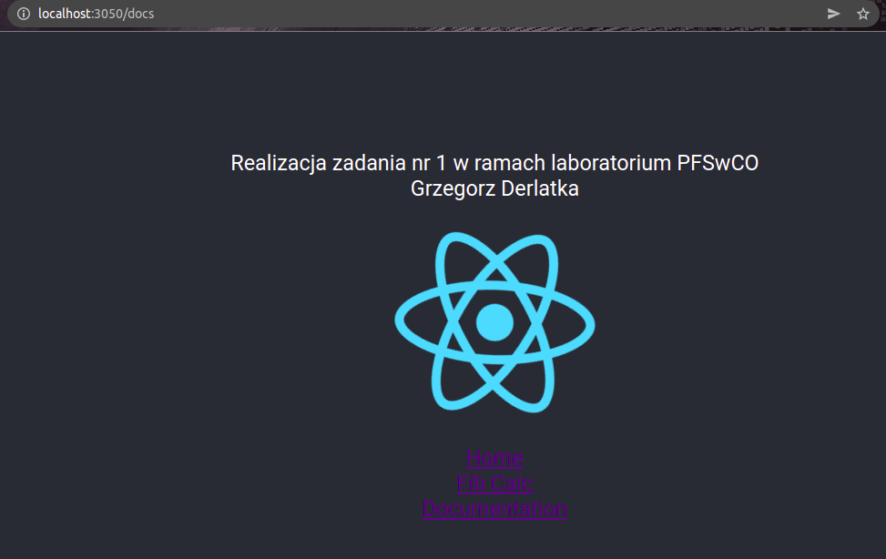

###Architekura aplikacji jest identyczna jak w przypadku lab 9.
###W projekcie zostały zmienione namiary na Travis'a, Docker Hub'a oraz AWS'a oraz dodane odpowiednie podstrony

###Aplikacja w trybie developerskim jest uruchamiana poleceniem: 
<code>docker-compose -f docker-compose.dev.yml up</code>

